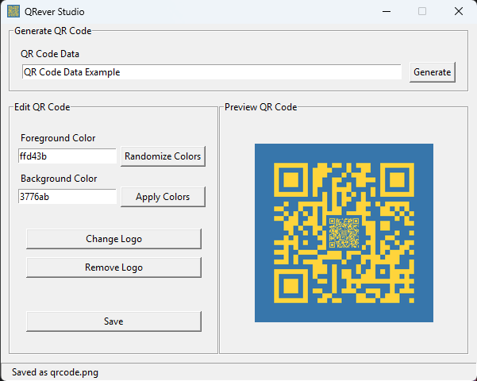

# QRever Studio

A QR code generator with color customizations and logo integration.

## Screenshot



## Usage

### With Python

- Install **Python 3** from [Python](https://www.python.org/downloads); to check the version:
```bash
python --version
```
- Clone the repository and install dependencies:
```bash
git clone https://github.com/dxn-scrlt/qrever-studio.git
cd qrever-studio
pip install -r requirements.txt
```
- Launch app
    - Run from the terminal:
    ```bash
    python main.py
    ```
    - Build and run a .exe:
    ```bash
    pip install pyinstaller
    pyinstaller --onefile --windowed --icon=assets/icon.ico --add-data "assets/icon.ico;assets" --name QRever-Studio main.py
    ```

### With .exe
- Download [QRever-Studio.exe](dist/QRever-Studio.exe)
- Run the EXE
    - Run from the terminal:
    ```bash
    QRever-Studio.exe
    ```
    - Double-click the EXE

## Features

- Foreground and background color customization
- Center-logo integration support
- Real-time QR code preview
- Classic UI with live status feedback
- Unlimited-use, non-expiring QR code output

## Tech Stack


